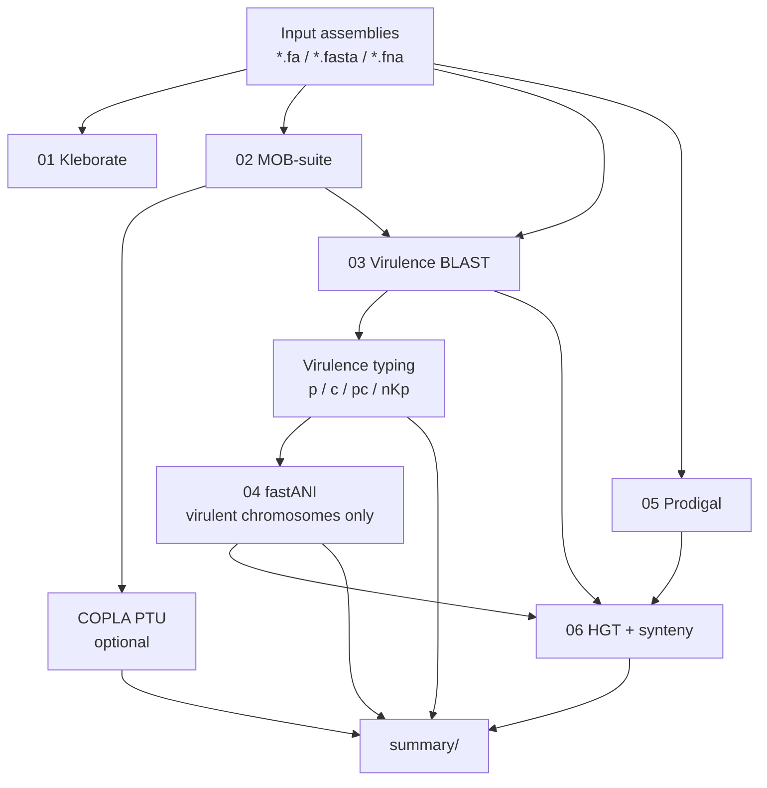

# Kp-VirTracer

**A reproducible R package and command-line workflow for virulence tracing in *Klebsiella pneumoniae* genome assemblies.**

[](LICENSE)


Kp-VirTracer integrates strain typing, plasmid reconstruction, virulence-gene screening, chromosome-aware relatedness, and preliminary HGT inference into a single, configuration-driven pipeline with explicit **chromosome / plasmid** interpretation.

---

## Overview

Hypervirulence in *K. pneumoniae* may be encoded on plasmids, chromosomes, or both. Kp-VirTracer is designed to:

- screen user-defined virulence loci by BLAST
- assign hits to chromosome or plasmid using MOB-suite contig typing
- optionally call plasmid PTU with COPLA
- classify each sample as `p-hvKp`, `c-hvKp`, `pc-hvKp`, or `nKp`
- compute ANI only among virulent isolates, using chromosome-only sequences
- annotate CDS with Prodigal and score chromosomal flanking synteny for related pairs
- emit standardized tabular reports for downstream epidemiology and manuscript use

> **Scope note.** This release focuses on virulence context and relatedness. Antimicrobial resistance (AMR) gene calling is not included.

---

## Pipeline

Six sequential stages (minimum **two** input assemblies):



| Stage | Module | Role |
|------:|--------|------|
| 1 | Kleborate | Species / ST / virulence score |
| 2 | MOB-suite (+ optional COPLA) | Contig molecule type, plasmids, PTU |
| 3 | BLAST | Virulence hits with location labels |
| 4 | fastANI | Relatedness among virulent chromosomes |
| 5 | Prodigal | Genome CDS annotation (GFF / FAA) |
| 6 | HGT | Shared-gene events; chromosomal synteny when applicable |

---

## Features

- **Compartment-aware virulence typing** (`p-hvKp` / `c-hvKp` / `pc-hvKp` / `nKp`)
- **Optional COPLA PTU** integration (non-blocking; default topology `circular`)
- **ANI restricted** to virulent isolates and chromosome-only FASTA
- **Synteny_Index** for ANI-related pairs with shared **chromosomal** virulence genes (ordered Prodigal flanking CDS)
- YAML configuration with CLI overrides for BLAST and ANI
- Automatic BLAST retry (`blastn-short` → `blastn`) when no hits are returned

---

## Requirements

| Component | Notes |
|-----------|--------|
| Conda / Mamba | Environment from `environment.yml` |
| R ≥ 4.1 | Package runtime |
| External tools | `kleborate`, `mob_recon`, `blastn`, `makeblastdb`, `fastANI`, `prodigal` |
| For synteny | `blastp` (typically installed with BLAST+) |
| Optional | COPLA in a dedicated conda environment |

---

## Installation

```bash
git clone https://github.com/wrd970427-droid/Kp-VirTracer.git
cd Kp-VirTracer

mamba env create -f environment.yml
mamba activate kpvirtracer
# or: bash install_env.sh

Rscript install_package.R
bash scripts/check_env.sh
```

Reinstall after modifying package source:

```bash
Rscript install_package.R
```

### Optional: COPLA

COPLA is **not** bundled in `environment.yml`. Install it separately (see the [COPLA](https://github.com/santirdnd/COPLA) documentation), download databases, then enable it in your YAML:

```yaml
copla:
  enabled: true
  conda_bin: "/abs/path/to/conda"
  conda_env: "copla"
  python_bin: "python3"
  script_path: "/abs/path/to/COPLA/bin/copla.py"
  pickle_path: "/abs/path/to/COPLA/databases/Copla_RS84/RS84f_sHSBM.pickle"
  fofn_path: "/abs/path/to/COPLA/databases/Copla_RS84/CoplaDB.fofn"
  topology: "circular"
```

If COPLA is disabled or misconfigured, the pipeline continues and PTU fields remain `NA`.

---

## Prerequisite: virulence BLAST database

```bash
makeblastdb \
  -in /path/to/virulence_genes.fasta \
  -dbtype nucl \
  -out /path/to/db/virulence_db
```

Pass the **database prefix** (`-out` value) to `--virulence-db`. Do **not** pass a raw FASTA path.

Example target genes (configurable): `iroB`, `iucA`, `peg344`, `rmpA`, `rmpA2`.

---

## Quick start

```bash
cp inst/extdata/config.yaml.example my_config.yaml
# edit paths as needed

Rscript run_kpvirtracer.R \
  --input /path/to/fasta_dir \
  --output /path/to/output_dir \
  --virulence-db /path/to/db/virulence_db \
  --config my_config.yaml \
  --threads 8
```

### Common overrides

```bash
# BLAST
--blast-task blastn \
--blast-evalue 1e-10 \
--blast-min-identity 90 \
--blast-min-coverage 80

# ANI
--ani-relatedness 99 \
--ani-min-fraction 0.2 \
--ani-frag-len 3000 \
--ani-kmer 16
```

| Option | Description |
|--------|-------------|
| `--input` / `--output` | Input FASTA directory / output directory (**required**) |
| `--virulence-db` | BLAST DB prefix (**required**) |
| `--config` | YAML configuration path |
| `--threads` | Thread count (default: 4) |
| `--force` / `--resume` / `--verbose` | Runtime flags |

---

## Methods (summary)

### Virulence typing

BLAST hits are located using MOB-suite `contig_report.txt`:

| Type | Definition |
|------|------------|
| `p-hvKp` | Virulence hits on plasmid only |
| `c-hvKp` | Virulence hits on chromosome only |
| `pc-hvKp` | Hits on both compartments |
| `nKp` | No virulence hit |

### Relatedness (ANI)

- Computed only for non-`nKp` samples
- Input = chromosome-only FASTA reconstructed from MOB contig labels
- Pairs with ANI ≥ threshold (default **99%**) are labelled `Related`

### Synteny index (HGT stage)

`Synteny_Index` is computed **only** when:

1. the pair is ANI-`Related`, and  
2. the shared gene has a **chromosome** hit in **both** samples  

Procedure: map each hit to the overlapping Prodigal CDS → extract ordered upstream/downstream flanks (default ±5) → link proteins with `blastp` → score **order-preserving** homologs (local inversion allowed). Plasmid-only shared genes receive `NA`.

`Confirmed` for chromosomal synteny events additionally requires `Synteny_Index ≥ vertical_cutoff` (default 7). Plasmid-associated events rely on relatedness / location-switch heuristics.

### Interpretation guidance

HGT outputs are **evidence-oriented heuristics** for shared virulence modules between related backgrounds. They are intended to support compartment-aware and neighbourhood-aware inference, not to replace full phylogenetic reconciliation or experimental confirmation.

---

## Output layout

```text
output/
├── sample_manifest.tsv
├── plasmid_manifest.tsv
├── 01_kleborate/
├── 02_mobsuite/                 # + optional copla/<plasmid>/
├── 03_blast_virulence/
│   ├── raw/  filtered/  by_location/  summary/
├── 04_ani/
├── 05_annotation/
├── 06_hgt/                      # hgt_events.tsv, synteny_results.tsv
└── summary/
    ├── sample_summary.tsv
    ├── virulence_hits.tsv
    ├── virulence_type_summary.tsv
    └── final_summary.tsv
```

### Primary result tables

| File | Contents |
|------|----------|
| `summary/sample_summary.tsv` | Per-sample virulence type, gene lists, plasmid/PTU summary, Kleborate score |
| `03_blast_virulence/summary/virulence_hits.tsv` | Filtered hits with location, coordinates, identity/coverage |
| `02_mobsuite/plasmid_manifest.tsv` | MOB-suite plasmid metadata + optional COPLA PTU fields |
| `04_ani/ani_results.tsv` | Pairwise ANI and Related/Unrelated calls |
| `06_hgt/hgt_events.tsv` | Shared-gene events, HGT type, `Synteny_Index`, confirmation flag |
| `summary/final_summary.tsv` | Run-level counts (samples, virulent samples, ANI pairs, HGT rows) |

Detailed column descriptions for intermediate tables are stable across runs; see table headers in each TSV for field definitions.

---

## Configuration

Copy and edit the example:

```bash
cp inst/extdata/config.yaml.example my_config.yaml
```

Key sections: `tools`, `copla`, `blast`, `ani`, `synteny`, `hgt`, `runtime`.

Default synteny parameters:

```yaml
synteny:
  upstream_cds: 5
  downstream_cds: 5
  protein_identity: 70
  protein_coverage: 70
  vertical_cutoff: 7
```

---

## Status and limitations

| Component | Status |
|-----------|--------|
| Six-stage pipeline | Implemented |
| Optional COPLA PTU (`circular` default) | Implemented |
| Chromosomal synteny (related pairs) | Implemented |
| HGT event deduplication (`dedup.R`) | Not yet implemented |
| AMR gene detection | Not implemented |

Additional caveats:

- Synteny and HGT calls depend on assembly quality, MOB contig assignment, and Prodigal annotation completeness.
- COPLA may return unassigned PTU for plasmids in small sHSBM clusters; this is a classifier outcome, not a pipeline failure.
- Long-read / hybrid plasmid resolution remains the gold standard for confirming fusion and backbone structure.

---

## Citation

Please cite the original tools used in your environment and versions, including:

- Kleborate  
- MOB-suite  
- COPLA (if enabled)  
- BLAST+  
- FastANI  
- Prodigal  

---

## License

MIT — see [LICENSE](LICENSE).

## Repository

https://github.com/wrd970427-droid/Kp-VirTracer
