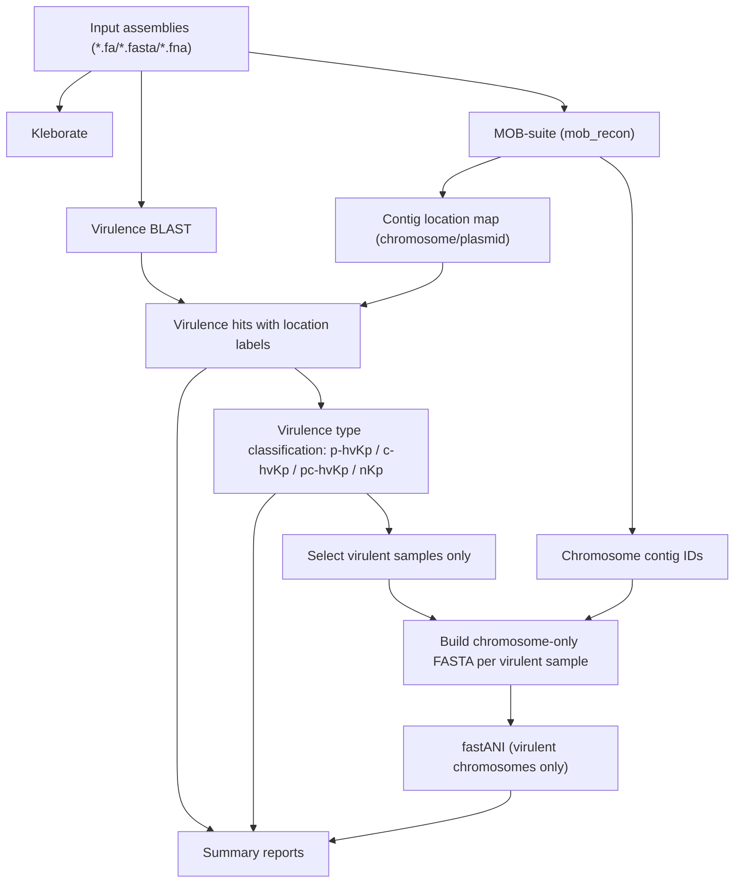

# Kp-VirTracer

Kp-VirTracer is a reproducible R-based workflow for tracing virulence signals and relatedness in *Klebsiella pneumoniae* genome assemblies, with explicit chromosome/plasmid-aware interpretation.

## Why This Project

Hypervirulence in *K. pneumoniae* can be associated with plasmid-borne, chromosome-borne, or mixed virulence determinants. Kp-VirTracer provides a practical pipeline to:

- screen virulence loci by BLAST
- separate chromosome and plasmid evidence using MOB-suite contig typing
- infer plasmid PTU using COPLA (when available)
- classify each sample into `p-hvKp`, `c-hvKp`, `pc-hvKp`, or `nKp`
- run ANI only on virulent strains using chromosome-only sequences

## 研究背景与意义（中文）

在近缘肺炎克雷伯菌（尤其是高风险谱系）中，近期HGT识别面临一个典型难题：

- 宿主间进化距离很近，近期转移片段可提供的系统发育信息位点有限
- 在这种场景下，`gene tree` 与 `species tree` 的“一致”并不总能证明“纯垂直继承”
- 传统“树冲突法”并非错误，而是对“近缘、近期、模块化、质粒介导传播”的检测功效会下降

因此，本项目采用的是“互补证据框架”，而不是“替代系统发育”：

1. 用系统发育信息作为宿主背景约束（host background constraint）。
2. 用区室与载体证据补足盲区：染色体/质粒分区、局部共线性、PTU/replicon、oriT/relaxase/T4SS、IS与融合线索。
3. 用机制一致性支持传播推断：不仅回答“像不像HGT”，也回答“为什么能够发生传播”。

这套框架的实际价值在于：

- 对近缘菌中近期毒力模块传播更敏感
- 对“non-conjugative 但可被 helper 动员”的真实场景更有解释力
- 输出可直接用于流调汇报、风险分层和后续实验验证设计

简要定位：

- Kp-VirTracer is a **phylogeny-constrained, mechanism-aware** workflow for recent plasmid-borne virulence dissemination inference.

## Workflow Overview



## Key Features

- Chromosome/plasmid-aware virulence interpretation.
- Explicit virulence type output:
  - `p-hvKp`: virulence genes on plasmid only
  - `c-hvKp`: virulence genes on chromosome only
  - `pc-hvKp`: virulence genes on both
  - `nKp`: no virulence hit
- ANI analysis constrained to biologically relevant comparisons:
  - virulent strains only
  - chromosome sequences only
- PTU assignment integrates COPLA output into `plasmid_manifest.tsv` (optional, non-blocking).
- CLI parameter overrides for both BLAST and ANI while keeping sensible defaults from config.

## Installation

### 1) Clone

```bash
git clone https://github.com/wrd970427-droid/Kp-VirTracer.git
cd Kp-VirTracer
```

### 2) Create Conda/Mamba Environment

```bash
mamba env create -f environment.yml
mamba activate kpvirtracer
```

If `mamba` is unavailable:

```bash
conda env create -f environment.yml
conda activate kpvirtracer
```

### 3) Install R Package

```bash
Rscript install_package.R
```

Note: if you modify package source code, reinstall before running CLI entry scripts.

### 4) Optional: Install COPLA In a Dedicated Conda Environment

COPLA is not installed through this repository `environment.yml`. Install it separately following the official project style:

```bash
PROJECT_ROOT_DIRECTORY=~/COPLA
git clone https://github.com/santirdnd/COPLA ${PROJECT_ROOT_DIRECTORY}
cd ${PROJECT_ROOT_DIRECTORY}

conda env create -f copla.environment.yml -n copla
```

If needed by your COPLA setup, install MacSyFinder in its dedicated environment:

```bash
conda env create -f macsyfinder.environment.yml -n macsyfinder
```

Download COPLA databases:

```bash
cd ${PROJECT_ROOT_DIRECTORY}
bin/download_Copla_databases.sh
head databases/Copla_RS84/CoplaDB.fofn
```

Recommended post-install check:

```bash
bin/post_install_test.sh
```

Then configure Kp-VirTracer to call this COPLA environment (see config section below).

## Required Prerequisite: Build Virulence BLAST DB

```bash
makeblastdb \
  -in /path/to/virulence_genes.fasta \
  -dbtype nucl \
  -out /path/to/db/virulence_db
```

Rules:

- pass BLAST DB prefix to `--virulence-db`
- do not pass raw FASTA to `--virulence-db`

## COPLA Configuration In Kp-VirTracer

Edit your config file (or `inst/extdata/config.yaml.example`) and set:

```yaml
copla:
  enabled: true
  conda_bin: "conda"
  conda_env: "copla"
  python_bin: "python3"
  script_path: "/abs/path/to/COPLA/bin/copla.py"
  pickle_path: "/abs/path/to/COPLA/databases/Copla_RS84/RS84f_sHSBM.pickle"
  fofn_path: "/abs/path/to/COPLA/databases/Copla_RS84/CoplaDB.fofn"
  topology: "linear"
```

### How Users Can Locate Their Own COPLA Paths

Run the following commands on the target server:

```bash
# 1) Locate COPLA script
find / -type f -name "copla.py" 2>/dev/null

# 2) Locate COPLA model pickle
find / -type f -name "RS84f_sHSBM.pickle" 2>/dev/null

# 3) Locate COPLA database fofn
find / -type f -name "CoplaDB.fofn" 2>/dev/null

# 4) Locate conda executable
which conda

# 5) Confirm COPLA environment exists
conda env list | grep -E '^copla\\s'
```

Use the discovered absolute paths in the `copla:` config section.

Runtime behavior:

- if COPLA is fully configured, PTU is inferred and written to `02_mobsuite/plasmid_manifest.tsv`
- if COPLA is missing or misconfigured, pipeline does not stop; a warning is logged and PTU fields remain `NA`

Quick validation before running pipeline:

```bash
conda run -n copla python3 /abs/path/to/COPLA/bin/copla.py --help
```

## Quick Start

```bash
Rscript run_kpvirtracer.R \
  --input /path/to/fasta_dir \
  --output /path/to/output_dir \
  --virulence-db /path/to/db/virulence_db \
  --threads 8
```

### Optional BLAST Overrides

```bash
Rscript run_kpvirtracer.R \
  --input /path/to/fasta_dir \
  --output /path/to/output_dir \
  --virulence-db /path/to/db/virulence_db \
  --blast-task blastn \
  --blast-evalue 1e-10 \
  --blast-min-identity 90 \
  --blast-min-coverage 80 \
  --threads 8
```

### Optional ANI Overrides

```bash
Rscript run_kpvirtracer.R \
  --input /path/to/fasta_dir \
  --output /path/to/output_dir \
  --virulence-db /path/to/db/virulence_db \
  --ani-relatedness 99 \
  --ani-min-fraction 0.2 \
  --ani-frag-len 3000 \
  --ani-kmer 16 \
  --threads 8
```

## Output Structure

```text
output/
|- logs/
|- temp/
|- sample_manifest.tsv
|- 01_kleborate/
|- 02_mobsuite/
|- 03_blast_virulence/
|  |- logs/
|  |- raw/
|  |- filtered/
|  |- by_location/
|  `- summary/
|- 04_ani/
|- 05_annotation/
|- 06_hgt/
`- summary/
```

Key files:

- `02_mobsuite/plasmid_manifest.tsv`
- `summary/sample_summary.tsv`
- `summary/virulence_type_summary.tsv`
- `summary/virulence_hits.tsv`
- `03_blast_virulence/summary/sample_virulence_profile.tsv`
- `03_blast_virulence/summary/virulence_type_calls.tsv`
- `04_ani/ani_results.tsv`
- `05_annotation/annotation_manifest.tsv`
- `05_annotation/annotation_summary.tsv`
- `06_hgt/hgt_events.tsv`
- `summary/final_summary.tsv`

## Result Tables And Column Dictionary

### `02_mobsuite/plasmid_manifest.tsv`

- `Sample_ID`: sample identifier derived from input FASTA filename.
- `MOB_Status`: execution status of `mob_recon` (`ok`, `failed`, `not_run`).
- `plasmid_id`: plasmid/contig identifier reported by MOB-suite.
- `replicon_type`: replicon typing result.
- `relaxase`: relaxase typing result.
- `mobility`: predicted mobility class from MOB-suite.
- `predicted_host_range`: host range estimate from MOB-suite.
- `PTU`: PTU assignment from COPLA (if available); `NA` when unassigned/unavailable.
- `PTU_Score`: COPLA confidence score; higher indicates more stable assignment.
- `PTU_Host_Range`: COPLA host range annotation (if reported).
- `PTU_Notes`: COPLA notes/warnings (for example, unassigned cluster size notes).

Interpretation:

- `PTU=NA` with notes like "could not be assigned" usually means the plasmid does not map confidently to a named PTU.
- `MOB_Status=ok` but `PTU=NA` is possible and biologically plausible.

### `03_blast_virulence/summary/virulence_hits.tsv`

- `Sample_ID`: sample identifier.
- `Gene`: virulence gene matched in BLAST database.
- `Location`: inferred location (`chromosome` or `plasmid`) using MOB contig typing.
- `Contig_ID`: matched query contig identifier.
- `Start`, `End`, `Strand`: hit coordinates and orientation on query contig.
- `Identity`: BLAST percent identity.
- `Coverage`: estimated coverage percentage for the hit.
- `Evalue`: BLAST e-value.
- `Bitscore`: BLAST bitscore.
- `Plasmid_ID`: reserved field (currently may be `NA`).
- `Source_FASTA`: original assembly FASTA path.

Interpretation:

- High-confidence hits should satisfy your configured identity/coverage/evalue thresholds.
- `Location` is central for downstream `p-hvKp/c-hvKp/pc-hvKp` classification.

### `03_blast_virulence/summary/sample_virulence_profile.tsv`

- `Sample_ID`: sample identifier.
- `Virulence_Genes_All`: all detected virulence genes.
- `Chromosomal_Genes`: subset detected on chromosome contigs.
- `Plasmid_Genes`: subset detected on plasmid contigs.
- `n_chrom_hits`: count of chromosome-assigned hits.
- `n_plasmid_hits`: count of plasmid-assigned hits.
- `Virulence_Location`: `chromosome`, `plasmid`, `both`, or `absent`.
- `Virulence_Type`: final per-sample type (`c-hvKp`, `p-hvKp`, `pc-hvKp`, `nKp`).

### `03_blast_virulence/summary/virulence_type_calls.tsv`

- `Sample_ID`: sample identifier.
- `Virulence_Location`: location category used for typing.
- `Virulence_Type`: final virulence type.
- `n_chrom_hits`: chromosome hit count.
- `n_plasmid_hits`: plasmid hit count.

### `summary/sample_summary.tsv`

- `Sample_ID`: sample identifier.
- `Virulence_Type`: one of `p-hvKp/c-hvKp/pc-hvKp/nKp`.
- `hvKp_Status`: compact status (`hvKp` vs `nKp`).
- `Virulence_Genes`, `Chromosomal_Genes`, `Plasmid_Genes`: gene lists used for typing.
- `Virulence_Location`: `chromosome/plasmid/both/absent`.
- `Plasmid_Count`: number of plasmid rows in plasmid manifest.
- `Replicon_Types`: merged replicon annotations.
- `PTU_Types`: merged PTU annotations.
- `Kleborate_Virulence_Score`: Kleborate virulence score when available.

### `summary/virulence_type_summary.tsv`

- `Virulence_Type`: virulence class.
- `n_samples`: number of samples in each class.

### `04_ani/ani_results.tsv`

- `Sample_A`, `Sample_B`: compared virulent samples.
- `ANI`: average nucleotide identity.
- `FragmentsMapped`: mapped fragment count reported by FastANI.
- `FragmentsTotal`: total fragments considered.
- `Relatedness`: `Related`, `Unrelated`, or `Unknown` (based on ANI threshold and output availability).

Interpretation:

- ANI runs only for virulent samples and only on chromosome-only FASTA.
- `Relatedness=Related` means ANI met/exceeded `--ani-relatedness`.

### `05_annotation/annotation_manifest.tsv`

- `Sample_ID`: sample identifier.
- `Contig_ID`: contig identifier.
- `molecule_type`: `chromosome` or `plasmid` (from MOB contig report).
- `n_virulence_hits`: count of virulence hits on this contig.
- `Virulence_Genes`: comma-separated virulence genes detected on this contig.
- `Prodigal_Status`: status of prodigal run for that sample (`ok`, `failed`, `not_run`).

### `05_annotation/annotation_summary.tsv`

- `Sample_ID`: sample identifier.
- `n_contigs`: number of contigs included in annotation manifest.
- `n_virulence_contigs`: number of contigs with at least one virulence hit.
- `Prodigal_Status`: sample-level prodigal status.

### `06_hgt/hgt_events.tsv`

- `Sample_A`, `Sample_B`: sample pair.
- `Gene`: shared virulence gene considered for event inference.
- `Location_A`, `Location_B`: gene location in each sample.
- `Plasmid_A`, `Plasmid_B`: plasmid flag placeholders for plasmid-associated entries.
- `HGT_Type`: event heuristic label (`location_switch`, `shared_plasmid_gene`, `shared_chromosomal_gene`).
- `Confirmed`: heuristic confirmation flag using ANI/location consistency.
- `pident`, `qcov`: aggregated identity/coverage evidence from virulence hits.
- `Synteny_Index`: placeholder/basic synteny score (current implementation baseline).
- `Evidence_Files`: primary files used for inference.

### `summary/final_summary.tsv`

- `n_samples`: total number of analyzed samples.
- `n_virulence`: number of samples with virulence type not equal to `nKp`.
- `n_ani_pairs`: number of ANI pairwise comparisons performed.
- `n_hgt_events`: number of inferred HGT rows.

## Virulence Typing Rules

- BLAST hits are assigned to chromosome/plasmid by MOB-suite `contig_report.txt`.
- BLAST stage writes layered outputs:
  - `raw/`: raw `outfmt 6` results per sample
  - `filtered/`: threshold-filtered results per sample
  - `by_location/`: chromosome/plasmid split results per sample
  - `summary/`: merged hit table and sample-level virulence calls
- Classification per sample:
  - `p-hvKp`: plasmid-only virulence hits
  - `c-hvKp`: chromosome-only virulence hits
  - `pc-hvKp`: both chromosome and plasmid virulence hits
  - `nKp`: no virulence hit

## ANI Rules

- ANI is run only for virulent samples (`p-hvKp`, `c-hvKp`, `pc-hvKp`).
- ANI input is reconstructed chromosome-only FASTA from MOB-suite chromosome contig IDs.
- Relatedness is reported by threshold (`--ani-relatedness`, default from config).

## PTU Calling (COPLA)

- `mob_recon` is used for plasmid reconstruction and plasmid/chromosome labeling.
- PTU is called by COPLA from extracted plasmid FASTA per sample via:
  - `conda run -n <copla_env> python3 <copla.py> <query_fasta> <RS84f_sHSBM.pickle> <CoplaDB.fofn> <output_dir>`
- COPLA is optional:
  - if available and configured, PTU/score are filled into `02_mobsuite/plasmid_manifest.tsv`
  - if unavailable/misconfigured, workflow continues and PTU fields remain `NA`

## Environment Validation

```bash
bash scripts/check_env.sh
```

## Smoke Test

```bash
bash scripts/smoke_test.sh
```

## Methodological Context

Kp-VirTracer integrates ideas and tools commonly used in published microbial genomics pipelines, including:

- Kleborate
- MOB-suite
- BLAST+
- FastANI

For manuscript writing or formal citation sections, please cite the corresponding original tool publications used in your analysis environment/version.
