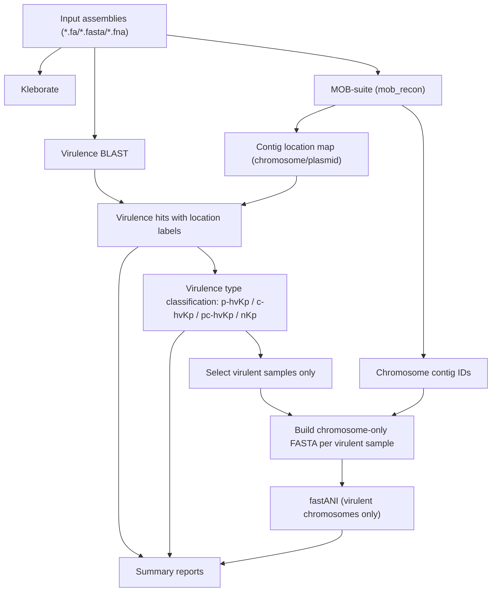

# Kp-VirTracer

Kp-VirTracer is a reproducible R-based workflow for tracing virulence signals and relatedness in *Klebsiella pneumoniae* genome assemblies, with explicit chromosome/plasmid-aware interpretation.

## Why This Project

Hypervirulence in *K. pneumoniae* can be associated with plasmid-borne, chromosome-borne, or mixed virulence determinants. Kp-VirTracer provides a practical pipeline to:

- screen virulence loci by BLAST
- separate chromosome and plasmid evidence using MOB-suite contig typing
- infer plasmid PTU using COPLA (when available)
- classify each sample into `p-hvKp`, `c-hvKp`, `pc-hvKp`, or `nKp`
- run ANI only on virulent strains using chromosome-only sequences

## Workflow Overview



## Key Features

- Chromosome/plasmid-aware virulence interpretation.
- Explicit virulence type output:
  - `p-hvKp`: virulence genes on plasmid only
  - `c-hvKp`: virulence genes on chromosome only
  - `pc-hvKp`: virulence genes on both
  - `nKp`: no virulence hit
- ANI analysis constrained to biologically relevant comparisons:
  - virulent strains only
  - chromosome sequences only
- PTU assignment integrates COPLA output into `plasmid_manifest.tsv` (optional, non-blocking).
- CLI parameter overrides for both BLAST and ANI while keeping sensible defaults from config.

## Installation

### 1) Clone

```bash
git clone https://github.com/wrd970427-droid/Kp-VirTracer.git
cd Kp-VirTracer
```

### 2) Create Conda/Mamba Environment

```bash
mamba env create -f environment.yml
mamba activate kpvirtracer
```

If `mamba` is unavailable:

```bash
conda env create -f environment.yml
conda activate kpvirtracer
```

### 3) Install R Package

```bash
Rscript install_package.R
```

Note: if you modify package source code, reinstall before running CLI entry scripts.

### 4) Optional: Install COPLA In a Dedicated Conda Environment

COPLA is not installed through this repository `environment.yml`. Install it separately following the official project style:

```bash
PROJECT_ROOT_DIRECTORY=~/COPLA
git clone https://github.com/santirdnd/COPLA ${PROJECT_ROOT_DIRECTORY}
cd ${PROJECT_ROOT_DIRECTORY}

conda env create -f copla.environment.yml -n copla
```

If needed by your COPLA setup, install MacSyFinder in its dedicated environment:

```bash
conda env create -f macsyfinder.environment.yml -n macsyfinder
```

Download COPLA databases:

```bash
cd ${PROJECT_ROOT_DIRECTORY}
bin/download_Copla_databases.sh
head databases/Copla_RS84/CoplaDB.fofn
```

Recommended post-install check:

```bash
bin/post_install_test.sh
```

Then configure Kp-VirTracer to call this COPLA environment (see config section below).

## Required Prerequisite: Build Virulence BLAST DB

```bash
makeblastdb \
  -in /path/to/virulence_genes.fasta \
  -dbtype nucl \
  -out /path/to/db/virulence_db
```

Rules:

- pass BLAST DB prefix to `--virulence-db`
- do not pass raw FASTA to `--virulence-db`

## COPLA Configuration In Kp-VirTracer

Edit your config file (or `inst/extdata/config.yaml.example`) and set:

```yaml
copla:
  enabled: true
  conda_bin: "conda"
  conda_env: "copla"
  python_bin: "python3"
  script_path: "/abs/path/to/COPLA/bin/copla.py"
  pickle_path: "/abs/path/to/COPLA/databases/Copla_RS84/RS84f_sHSBM.pickle"
  fofn_path: "/abs/path/to/COPLA/databases/Copla_RS84/CoplaDB.fofn"
  topology: "linear"
```

### How Users Can Locate Their Own COPLA Paths

Run the following commands on the target server:

```bash
# 1) Locate COPLA script
find / -type f -name "copla.py" 2>/dev/null

# 2) Locate COPLA model pickle
find / -type f -name "RS84f_sHSBM.pickle" 2>/dev/null

# 3) Locate COPLA database fofn
find / -type f -name "CoplaDB.fofn" 2>/dev/null

# 4) Locate conda executable
which conda

# 5) Confirm COPLA environment exists
conda env list | grep -E '^copla\\s'
```

Use the discovered absolute paths in the `copla:` config section.

Runtime behavior:

- if COPLA is fully configured, PTU is inferred and written to `02_mobsuite/plasmid_manifest.tsv`
- if COPLA is missing or misconfigured, pipeline does not stop; a warning is logged and PTU fields remain `NA`

Quick validation before running pipeline:

```bash
conda run -n copla python3 /abs/path/to/COPLA/bin/copla.py --help
```

## Quick Start

```bash
Rscript run_kpvirtracer.R \
  --input /path/to/fasta_dir \
  --output /path/to/output_dir \
  --virulence-db /path/to/db/virulence_db \
  --threads 8
```

### Optional BLAST Overrides

```bash
Rscript run_kpvirtracer.R \
  --input /path/to/fasta_dir \
  --output /path/to/output_dir \
  --virulence-db /path/to/db/virulence_db \
  --blast-task blastn \
  --blast-evalue 1e-10 \
  --blast-min-identity 90 \
  --blast-min-coverage 80 \
  --threads 8
```

### Optional ANI Overrides

```bash
Rscript run_kpvirtracer.R \
  --input /path/to/fasta_dir \
  --output /path/to/output_dir \
  --virulence-db /path/to/db/virulence_db \
  --ani-relatedness 99 \
  --ani-min-fraction 0.2 \
  --ani-frag-len 3000 \
  --ani-kmer 16 \
  --threads 8
```

## Output Structure

```text
output/
|- logs/
|- temp/
|- sample_manifest.tsv
|- 01_kleborate/
|- 02_mobsuite/
|- 03_blast_virulence/
|  |- logs/
|  |- raw/
|  |- filtered/
|  |- by_location/
|  `- summary/
|- 04_ani/
|- 05_annotation/
|- 06_hgt/
`- summary/
```

Key files:

- `summary/sample_summary.tsv`
- `summary/virulence_type_summary.tsv`
- `summary/virulence_hits.tsv`
- `03_blast_virulence/summary/sample_virulence_profile.tsv`
- `03_blast_virulence/summary/virulence_type_calls.tsv`
- `04_ani/ani_results.tsv`
- `06_hgt/hgt_events.tsv`
- `summary/final_summary.tsv`

## Virulence Typing Rules

- BLAST hits are assigned to chromosome/plasmid by MOB-suite `contig_report.txt`.
- BLAST stage writes layered outputs:
  - `raw/`: raw `outfmt 6` results per sample
  - `filtered/`: threshold-filtered results per sample
  - `by_location/`: chromosome/plasmid split results per sample
  - `summary/`: merged hit table and sample-level virulence calls
- Classification per sample:
  - `p-hvKp`: plasmid-only virulence hits
  - `c-hvKp`: chromosome-only virulence hits
  - `pc-hvKp`: both chromosome and plasmid virulence hits
  - `nKp`: no virulence hit

## ANI Rules

- ANI is run only for virulent samples (`p-hvKp`, `c-hvKp`, `pc-hvKp`).
- ANI input is reconstructed chromosome-only FASTA from MOB-suite chromosome contig IDs.
- Relatedness is reported by threshold (`--ani-relatedness`, default from config).

## PTU Calling (COPLA)

- `mob_recon` is used for plasmid reconstruction and plasmid/chromosome labeling.
- PTU is called by COPLA from extracted plasmid FASTA per sample via:
  - `conda run -n <copla_env> python3 <copla.py> <query_fasta> <RS84f_sHSBM.pickle> <CoplaDB.fofn> <output_dir>`
- COPLA is optional:
  - if available and configured, PTU/score are filled into `02_mobsuite/plasmid_manifest.tsv`
  - if unavailable/misconfigured, workflow continues and PTU fields remain `NA`

## Environment Validation

```bash
bash scripts/check_env.sh
```

## Smoke Test

```bash
bash scripts/smoke_test.sh
```

## Methodological Context

Kp-VirTracer integrates ideas and tools commonly used in published microbial genomics pipelines, including:

- Kleborate
- MOB-suite
- BLAST+
- FastANI

For manuscript writing or formal citation sections, please cite the corresponding original tool publications used in your analysis environment/version.
